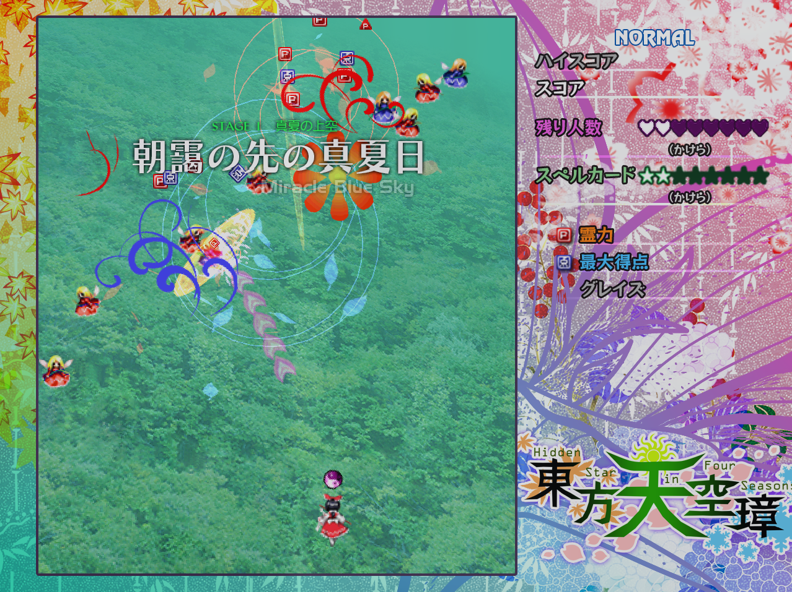

# Touhou 16 stage 1 clone

This is an attempt at recreating thouhou 16's first stage with c++ and OpenGL on linux

## Compile

This project depends on <a href="https://github.com/ClementChambard/NSEngine">NSEngine</a>, which is my own game engine.
I use simlinks with relative paths to link to the engine's folder with this folder, but if you only want to compile the project once, you can replace them with their respective folders.

*Currently, this can't be easily compiled on Windows or MacOS. If you want you can modify the CMakeLists.txt to fit your needs*

* You will need :
  - make
  - cmake
  - a c++ compiler

* Make sure you have the required libraries :
  - OpenGL and glew
  - glm
  - SDL2

* Clone the repo
 `git clone https://github.com/ClementChambard/TouhouClone.git`

* Create a build directory
 `mkdir build && cd build` 
 
* Run cmake to configure the project
 `cmake ..`
 
* Run make to compile
 `make`

* Copy or link the assets directory in the build directory
 `ln -s ../assets`

*I need to learn more about cmake and find a way to remove these parts*

* Run the executable
 `./TouhouNS`

## Contact

for further questions, contact me at clement.chambard@universite-paris-saclay.fr
